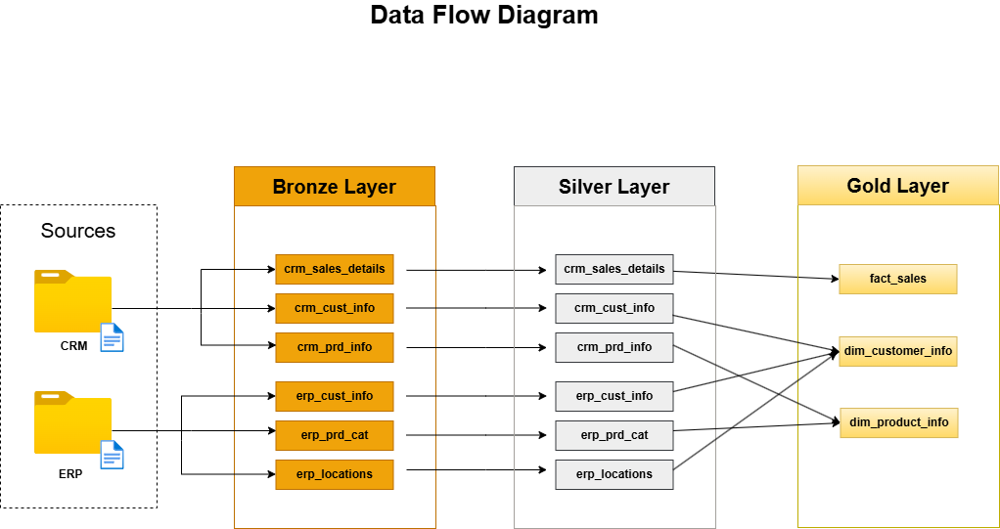

# SQL Data Warehouse 

---

## Overview
This project demonstrates how to design and build a small-scale **SQL Data Warehouse** using Microsoft SQL Server.  
It follows the Bronze → Silver → Gold pattern to show how raw data can be cleaned, transformed, and modeled for analytics.  

The repository includes:
- Sample CSV datasets (CRM and ERP sources)
- T-SQL scripts for DDL, DML, and transformations
- Stored procedures for repeatable loads
- Validation queries to test data quality and consistency
- Diagrams showing the architecture, data flow, and ERD design

The goal of this project is to highlight key data engineering skills such as data modeling, data quality management, and modular SQL development.

---

## Technologies Used
- Microsoft SQL Server (T-SQL)
- SQL Server Management Studio (SSMS)
- Draw.io for diagrams (ERD and data flow)
- CSV datasets as input
- GitHub for version control and documentation

---

## Connecting Data Sources using the Source Tables

- Purpose: Visualizes the logical relationships between tables across layers.
- Structure: Highlights how key entities (customers, products, and sales) are connected through primary and foreign keys.
Goal: Supports efficient joins, data integrity, and easy traceability from source to analytical layer.

## Data WareHouse Architecture

The warehouse uses a three-layer approach:

- **Sources (CRM & ERP):** Raw CSV files are used as input from business systems.  
- **Bronze Layer:** Stores the original data along with load logs for full traceability.  
- **Silver Layer:** Cleans, deduplicates, and standardizes the data to ensure consistency across sources.  
- **Gold Layer:** Builds business-ready analytical views following a star schema design for simplified reporting and dashboarding.
- **Auditing:** Each record includes a `dwh_create_date` column to track when it was processed in the warehouse.  
- **Performance:** Queries are optimized through set-based SQL operations, efficient data types, and selective indexing

## Pipeline (what runs, in order)

1) Initialize database and schemas
	- Script: `scripts/init_dwh.sql`
	- Action: creates the `DWH` database and schemas `bronze`, `silver`, `gold`.

2) Bronze layer — raw ingestion
	- Files: `scripts/Bronze/bronze_create_tables.sql`, `scripts/Bronze/load_data.sql`
	- Action: DDL for bronze tables that mirror source CSVs; `bronze.bronze_load_table_data` bulk-loads CSVs and reports runtime.

3) Silver layer — transform & quality
	- Files: `scripts/Silver/silver_create_tables.sql`, `scripts/Silver/transform_data.sql`
	- Action: create silver tables (adds `dwh_create_date`), then run `silver.silver_load_table_data` which: trims/normalizes, deduplicates (ROW_NUMBER()), converts types (varchar→date/decimal), applies business rules and normalizes values.

4) Gold layer — presentation
	- File: `scripts/Gold/gold_views.sql`
	- Action: creates `gold` views: `dim_customer_info`, `dim_product_info`, and `fact_sales` which join silver tables and create simple surrogate keys (ROW_NUMBER) for reporting convenience.

5) Validation queries
	- Files: `scripts/Silver/test_silver_layer.sql`, `scripts/Gold/test_gold.sql`
	- Action: queries that check duplicates, date consistency, FK integrity, and sales/price consistency.
---

## Results / Outputs
- Clean, structured data in **three layers** (Bronze → Silver → Gold)
- **Analytical views** ready for BI tools (fact and dimension models)
- **Data quality checks** confirming no duplicates or invalid values
- **Diagrams** showing data lineage, relationships, and architecture

---

## Business-Focused Data Model

 
- **Fact Table:** gold.fact_sales contains transactional data such as order dates, quantities, and prices.
- **Dimension Tables:** gold.dim_customer_info and gold.dim_product_info store descriptive data for customers and products.
- **Business Logic:** Calculates sales_amount = quantity * price and enables user-friendly reporting through surrogate keys.

---

## Key Learning Outcomes
- Built a complete data pipeline using SQL only.  
- Gained hands-on experience with dimensional modeling and ETL concepts.  
- Practiced writing modular, reusable SQL scripts and stored procedures.  
- Learned to design and document a structured database project.  

