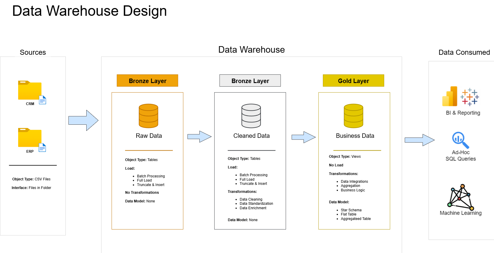
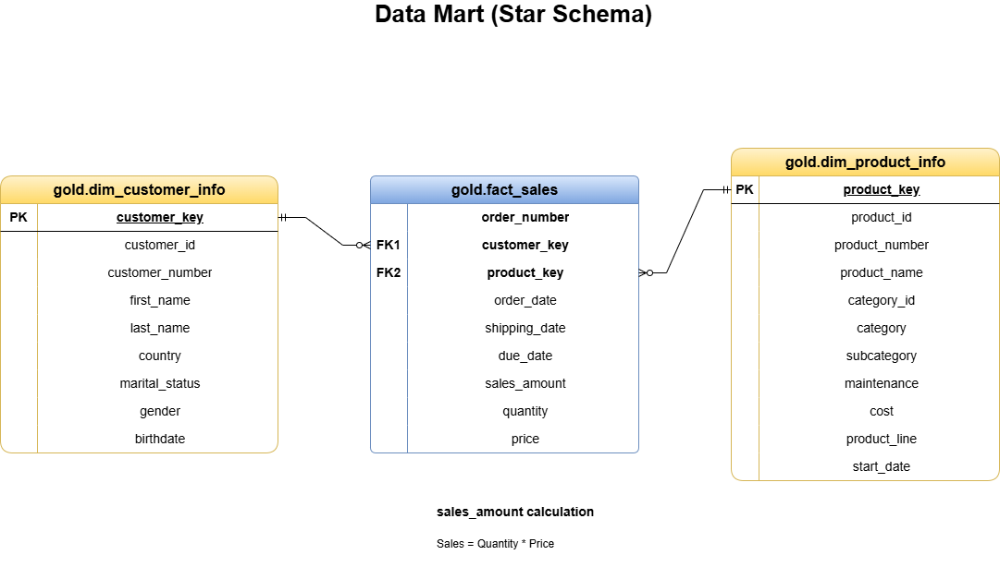

# SQL Data Warehouse — step-by-step project README

## Overview
This repository demonstrates a compact, layered SQL Data Warehouse (Bronze → Silver → Gold) implemented in T-SQL. It contains sample CSV inputs, DDL and DML scripts, stored procedures for repeatable loads and transforms, validation queries, and design diagrams illustrating data flow and the logical model.

## Goal (skills signaled)
This project intentionally surfaces practical, resume-ready SQL and data engineering skills, including:

- T-SQL development: stored procedures, views and modular scripts.
- Set-based transformations: JOINs, aggregations, CTEs and window functions (ROW_NUMBER(), LEAD()).
- Data-quality and cleansing patterns: trimming, type conversion, NULL handling, CASE logic and deduplication strategies.
- Bulk loading & ingestion: BULK INSERT patterns and load-time logging.
- Dimensional modeling: fact/dimension separation, surrogate keys, and simple star-schema patterns.
- Operational practices: scripted loads and validation queries.
- Auditing & lineage: adding `dwh_create_date` and preserving provenance in the Bronze layer.
- Basic performance awareness: data types and column choices, set-based processing, and places to add indexes or partitioning for scale.

These keywords and patterns map directly to common resume items and interview questions.

## Pipeline (what runs, in order)
1) Initialize database and schemas
	- Script: `scripts/init_dwh.sql`
	- Action: creates the `DWH` database and schemas `bronze`, `silver`, `gold`.

2) Bronze layer — raw ingestion
	- Files: `scripts/Bronze/bronze_create_tables.sql`, `scripts/Bronze/load_data.sql`
	- Action: DDL for bronze tables that mirror source CSVs; `bronze.bronze_load_table_data` bulk-loads CSVs and reports runtime.

3) Silver layer — transform & quality
	- Files: `scripts/Silver/silver_create_tables.sql`, `scripts/Silver/transform_data.sql`
	- Action: create silver tables (adds `dwh_create_date`), then run `silver.silver_load_table_data` which: trims/normalizes, deduplicates (ROW_NUMBER()), converts types (varchar→date/decimal), applies business rules and normalizes values.

4) Gold layer — presentation
	- File: `scripts/Gold/gold_views.sql`
	- Action: creates `gold` views: `dim_customer_info`, `dim_product_info`, and `fact_sales` which join silver tables and create simple surrogate keys (ROW_NUMBER) for reporting convenience.

5) Validation queries
	- Files: `scripts/Silver/test_silver_layer.sql`, `scripts/Gold/test_gold.sql`
	- Action: queries that check duplicates, date consistency, FK integrity, and sales/price consistency.

## Files at-a-glance
- `datasets/` — sample CSVs (CRM, ERP).
- `scripts/init_dwh.sql` — database and schema creation.
- `scripts/Bronze/bronze_create_tables.sql` — bronze DDL.
- `scripts/Bronze/load_data.sql` — bronze load procedure (BULK INSERT).
- `scripts/Silver/silver_create_tables.sql` — silver DDL.
- `scripts/Silver/transform_data.sql` — silver transformation procedure.
- `scripts/Silver/test_silver_layer.sql` — silver validation queries.
- `scripts/Gold/gold_views.sql` — gold views (dim/fact).
- `scripts/Gold/test_gold.sql` — gold validation queries.
- `diagrams/` — ERD, data flow, architecture and data-mart diagrams (PNG + drawio).

## Key design choices (brief)
- Bronze stores raw records from source systems; it includes a load-time log table.
- Silver applies cleansing, normalization and deduplication; it converts types and adds `dwh_create_date` for auditing.
- Gold exposes analytical views with surrogate keys (ROW_NUMBER) for simple, read-only access patterns.

## Diagrams (visual)
Open the files in `diagrams/` or view the PNGs below.

